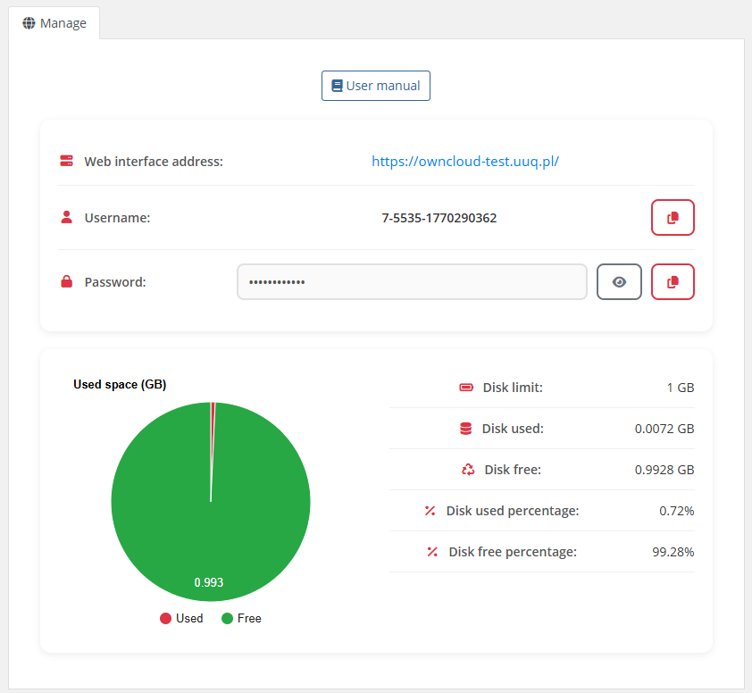

# Description

### ownCloud module **[WHMCS](https://puqcloud.com/link.php?id=77)**
#####  [Order now](https://puqcloud.com/whmcs-module-owncloud.php) | [Download](https://download.puqcloud.com/WHMCS/servers/PUQ_WHMCS-ownCloud/) | [FAQ](https://faq.puqcloud.com/)

## ownCloud WHMCS module

The ownCloud WHMCS module is a provisioning module that integrates WHMCS with ownCloud servers, enabling cloud service providers to offer ownCloud-based accounts to their customers. The module automates the full lifecycle of user account management through API integration with ownCloud.

---

## Main features

- **Automatic account provisioning** — auto create and deploy client ownCloud accounts upon order activation
- **Account lifecycle management** — create, suspend, unsuspend, terminate, change password, and change package (upgrade/downgrade) for ownCloud user accounts
- **Disk usage monitoring** — track and display disk usage statistics with historical data and configurable retention period
- **Email notifications** — automatic notifications when disk usage exceeds configurable thresholds, sent via WHMCS cron
- **Multi-language support** — 25 languages including Arabic, Catalan, Chinese, Croatian, Czech, Danish, Dutch, Estonian, Farsi, French, German, Hebrew, Hungarian, Italian, Macedonian, Norwegian, Polish, Romanian, Russian, Spanish, Swedish, Turkish, and Ukrainian
- **Client area integration** — customers can view server address, credentials with copy-to-clipboard, disk usage pie chart, usage statistics, and access user manual
- **Admin area tools** — administrators can view license status, API connection status, user details (username, enabled status, group, email), and disk usage with visual progress bar
- **Configurable username/password rules** — flexible rules for automatic username and password generation using macros ({client_id}, {service_id}, {random_digit_x}, {random_letter_x}, date/time macros)
- **Group management** — assign ownCloud groups to users on the server side, automatic group creation
- **Unlimited quota support** — set disk size to 0 for unlimited storage
- **License verification** — built-in license system with online/offline verification and admin alerts

---

## System requirements

| Requirement | Minimum |
|-------------|---------|
| WHMCS | 9.x or higher |
| PHP | 8.2 or higher |
| ownCloud | 10.x or higher |
| ionCube Loader | v13 or newer (v14, v15) |

---

## Links

- **Product page:** [https://puqcloud.com/whmcs-module-owncloud.php](https://puqcloud.com/whmcs-module-owncloud.php)
- **Documentation:** [https://doc.puq.info/books/owncloud-whmcs-module](https://doc.puq.info/books/owncloud-whmcs-module)
- **Support:** [https://puqcloud.com/submitticket.php](https://puqcloud.com/submitticket.php?step=2&deptid=1)
- **Community:** [https://community.puqcloud.com/](https://community.puqcloud.com/)

---

## Screenshots

### Client area — Home screen

*01-description-client-area.png*

### Client area — Disk statistics

*02-description-disk-stats.png*

### Admin area — Product information

*03-description-admin-area.png*
